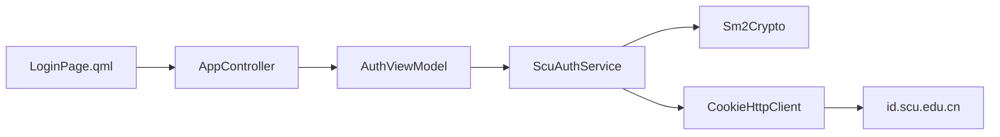
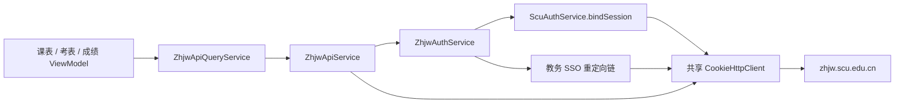
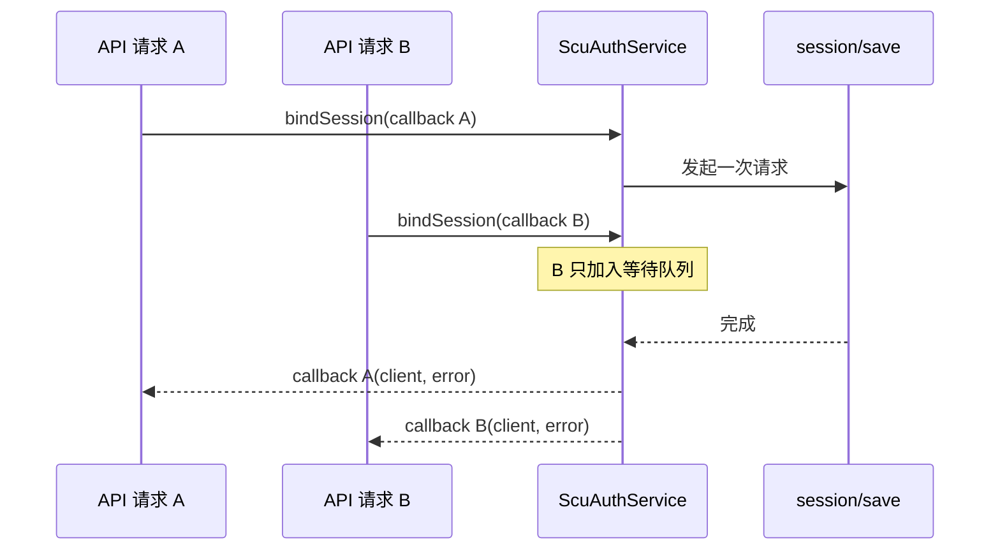

# Person B 代码深入阅读指南

> 适用范围：统一认证、Cookie HTTP 客户端、SM2、教务 SSO、教务 API、认证日志，以及这些能力与 QML、课表、考表、成绩模块之间的接口边界。

本文依据 `B.md` 和仓库当前实现整理。建议严格按照章节顺序阅读：先建立全局调用链，再进入网络和认证细节，最后阅读 API、下游适配和测试。

## 1. 先明确职责边界

Person B 负责：

- 通用异步 HTTP 请求和 Cookie 会话。
- 四川大学统一身份认证。
- 验证码获取和 SM2 密码加密。
- Token 保存、恢复和一小时 TTL。
- 统一认证会话绑定和教务 SSO。
- 当前教学周、学期、课表原始 JSON、考表、方案成绩、及格成绩 API。
- 对 QML 和其他模块提供稳定的异步接口。
- 认证与网络日志脱敏。

Person B 不负责：

- 课表 JSON 到 `Course` 的转换和课表数据库写入。
- 考表排序、缓存、过期状态和页面展示。
- 成绩模型、GPA、均分和学分统计。
- 校历页面抓取与解析。
- 登录页的视觉设计。
- 体测认证与 API。

阅读时可以用一句话判断代码归属：

> “获取远端数据并确认格式”属于 B；“把远端数据变成业务模型、缓存或页面状态”属于其他模块。

## 2. 全局调用链

先看下面两条主链路，后面的每个文件都可以放回这两条链路中理解。

### 2.1 登录链路



实际步骤：

1. 登录页请求验证码。
2. `AuthViewModel` 清理上一轮验证码状态。
3. `ScuAuthService` 请求验证码接口并解析图片。
4. `AuthViewModel` 把图片写入缓存目录，将 `file://` URL 暴露给 QML。
5. 用户输入账号、密码和验证码字符。
6. `ScuAuthService` 获取 SM2 公钥。
7. `Sm2Crypto` 把密码加密为接口要求的 C1C2C3 格式。
8. `ScuAuthService` 请求 `rest_token`。
9. 成功后只保存 Token 和登录时间戳，不保存密码。

### 2.2 教务 API 链路



这里最重要的设计是：

- `ScuAuthService`、`ZhjwAuthService` 和 `ZhjwApiService` 必须共享同一个认证链路。
- `session/save`、SSO 重定向和教务 API 必须复用同一个 `CookieHttpClient`。
- 多个业务请求同时到达时，认证层应合并并发的 bind/SSO，而不是重复登录。
- API 检测到教务会话失效后，只允许重新 SSO 并重试一次。

## 3. 第一站：应用如何组装 Person B 的服务

先阅读：

1. [`SCU_Nexus/main.cpp`](SCU_Nexus/main.cpp)
2. [`SCU_Nexus/src/app/AppController.h`](SCU_Nexus/src/app/AppController.h)
3. [`SCU_Nexus/src/app/AppController.cpp`](SCU_Nexus/src/app/AppController.cpp)

### 3.1 `main.cpp` 要看什么

重点寻找这些对象：

```cpp
ScuAuthService scuAuthService;
ZhjwAuthService zhjwAuthService(nullptr, &scuAuthService);
ZhjwApiService zhjwApiService(nullptr, &zhjwAuthService);
ZhjwApiQueryService zhjwQueryService(nullptr, &zhjwApiService);
```

需要理解：

- 为什么 `ScuAuthService` 只能创建一次并被后续服务共享。
- `AppController` 和教务认证链如何共享统一认证状态。
- `ScheduleImportViewModel::setRemoteApi()` 如何消费学期、课表 JSON 和当前周。
- 考表、成绩为什么通过 `ZhjwApiQueryService` 使用 B 层 API。
- `loginStateChanged` 只是页面级登录状态同步，真正的会话有效性仍需请求时检查。

### 3.2 `AppController` 要看什么

重点关注：

- `m_authViewModel` 的创建方式。
- `authViewModel` 如何以 `QObject*` 暴露给 QML。
- `AuthViewModel::loggedInChanged` 如何变成应用级登录状态。
- `sessionExpired` 如何通知应用回到未登录状态。

读完后应能回答：

1. 登录页和教务 API 是否使用同一个 `ScuAuthService`？
2. Token 恢复后，应用的 `loggedIn` 如何更新？
3. 为什么 `AppController` 不应该直接操作 Token 或 Cookie？

## 4. 第二站：统一错误和网络数据结构

按顺序阅读：

1. [`NetworkError.h`](SCU_Nexus/src/core/network/NetworkError.h)
2. [`HttpRequest.h`](SCU_Nexus/src/core/network/HttpRequest.h)
3. [`HttpResponse.h`](SCU_Nexus/src/core/network/HttpResponse.h)
4. [`NetworkSettings.h`](SCU_Nexus/src/core/network/NetworkSettings.h)
5. [`AuthErrors.h`](SCU_Nexus/src/services/auth/AuthErrors.h)
6. [`AuthState.h`](SCU_Nexus/src/services/auth/AuthState.h)

### 4.1 错误约定

当前回调通常使用：

```cpp
callback(result, {});
```

默认构造的 `ApiError` 类型是 `ApiErrorType::Unknown`，在当前代码中表示“没有错误”。因此阅读所有回调时要先识别这一约定：

```cpp
if (error.type != ApiErrorType::Unknown) {
    // 失败
}
```

`ApiError` 的三个对外层次：

- `type`：稳定的错误分类，供业务逻辑判断。
- `message`：可以展示给用户。
- `debugBody`：只用于诊断，不得直接暴露给 QML。

### 4.2 HTTP 响应约定

`HttpResponse` 保留：

- HTTP 状态码。
- 原始响应 body。
- 响应头。
- 手动重定向后的最终 URL。

尤其要注意：HTTP 400 不一定是网络错误。统一认证的 `rest_token` 可能在 400 body 中返回“验证码错误”等业务信息，因此网络层必须保留 body 让认证层解析。

### 4.3 公共网络配置

`NetworkSettings` 集中保存：

- 默认 15 秒超时。
- SSO 最大重定向次数。
- 所有校园站点共用的 User-Agent。

读完后应能回答：

1. 为什么 4xx/5xx 不能都转换成 `ApiErrorType::Network`？
2. 为什么 `debugBody` 不能直接显示在页面？
3. 为什么 User-Agent 必须放在网络层统一维护？

## 5. 第三站：Cookie 仓库

阅读：

1. [`CookieJar.h`](SCU_Nexus/src/core/network/CookieJar.h)
2. [`CookieJar.cpp`](SCU_Nexus/src/core/network/CookieJar.cpp)

### 5.1 当前实现的安全边界

`CookieJar` 不是完整浏览器 Cookie 实现。第一阶段规则是：

```text
目标 host == Cookie 仓库 host
或
目标 host 以 "." + Cookie 仓库 host 结尾
```

当前实现有意使用“响应 URL 的 host”作为存储键，并忽略 `Set-Cookie` 中声明的 `Domain` 和 `Path`。这样可以避免统一认证站点下发的宽域 Cookie 被发送到不相关的兄弟子系统。

示例：

```text
存储 host: id.scu.edu.cn

允许：
id.scu.edu.cn
sub.id.scu.edu.cn

拒绝：
zhjw.scu.edu.cn
evil-scu.edu.cn
```

### 5.2 多个 Set-Cookie 的解析

重点阅读：

- `storeFromSetCookie()`
- `splitCombinedSetCookieHeader()`
- `isCookiePairAhead()`

不能直接用逗号分割整个头，因为下面的 `Expires` 自身含逗号：

```text
Set-Cookie: SID=abc; Expires=Wed, 21 Oct 2026 07:28:00 GMT
```

当前算法只在逗号后看起来出现新的 `cookie-name=` 时切分。

### 5.3 日志安全

`cookieSummaryForDebug()` 只返回：

- Cookie 总数。
- 去重后的 Cookie 名称。

它不会返回 Cookie 值和 host，避免调试日志泄漏会话。

读完后应能回答：

1. 为什么不能把所有 Cookie 拼成一个全局 Header？
2. 为什么这里没有直接采用服务端的 `Domain=.scu.edu.cn`？
3. 为什么 `Expires` 会让简单的逗号分割失效？
4. 如果未来需要 Path、Secure、SameSite，应在哪一层扩展？

## 6. 第四站：异步 Cookie HTTP 客户端

阅读：

1. [`CookieHttpClient.h`](SCU_Nexus/src/core/network/CookieHttpClient.h)
2. [`CookieHttpClient.cpp`](SCU_Nexus/src/core/network/CookieHttpClient.cpp)

### 6.1 对外接口

主要接口：

- `get()`：普通 GET。
- `post()`：普通 POST。
- `followRedirects()`：SSO 使用的手动重定向 GET。
- `clearCookies()`：清除当前客户端会话。
- `cookieSummaryForDebug()`：安全调试摘要。

所有接口都通过回调异步返回，不阻塞 Qt UI 线程。

### 6.2 统一发送流程

重点精读 `send()`，按以下顺序追踪：

1. `buildRequest()` 设置手动重定向策略、UA 和目标域 Cookie。
2. 根据 method 调用 `QNetworkAccessManager::get/post`。
3. 创建单次触发的超时定时器。
4. Reply 完成后立即保存本跳 Cookie。
5. 判断超时。
6. 判断是否继续重定向。
7. 判断是否发生没有 HTTP 响应的传输故障。
8. 必要时只重试一次。
9. 构造 `HttpResponse` 并执行回调。

### 6.3 重定向语义

每一跳都必须：

- 根据新 URL 重新计算 Cookie。
- 保存当前响应的所有 `Set-Cookie`。
- 使用 `url.resolved(redirectUrl)` 处理相对 Location。
- 记录 hop、状态码和前后 host，但不记录 Cookie 值。

当前实现中：

- 303 会转换为 GET 并清空 body。
- 307/308 保留原方法和 body。
- 301/302 当前也保留原方法和 body。
- 普通 `get/post` 不允许跳转；`followRedirects` 才提供跳转额度。

### 6.4 值得重点核对的实现细节

阅读 `send()` 的重定向上限分支，再对照 `ZhjwApiService::isSessionExpired()`：

- API 层具备按 302 判断会话过期的逻辑。
- 网络层的普通 `get/post` 以零重定向额度调用 `send()`。
- 当前 `send()` 会把带有效 Location 的零额度 3xx 映射为“重定向链超过上限”。

这意味着真实 302 是否能按 API 层预期进入“会话过期并重试”分支，值得通过一个真实 `CookieHttpClient` 的 302 单元测试进一步确认。这是阅读时应主动验证的接口契约，不要只看某一层的函数名推断行为。

读完后应能回答：

1. 为什么 Cookie 必须在判断下一跳之前保存？
2. 哪些错误会触发一次网络重试？
3. 为什么有 HTTP 400 响应时不执行传输层重试？
4. 普通 API 请求和 SSO 请求为什么使用不同的重定向策略？

## 7. 第五站：认证日志与脱敏

阅读：

1. [`AuthLogger.h`](SCU_Nexus/src/core/logging/AuthLogger.h)
2. [`AuthLogger.cpp`](SCU_Nexus/src/core/logging/AuthLogger.cpp)

重点理解：

- `AuthLogEntry::format()` 如何生成可导出文本。
- `AuthLogRedactor::apply()` 覆盖了哪些 JSON、表单、查询参数和请求头格式。
- `AuthLogger::log()` 为什么必须在写入内存前再次脱敏。
- 容量上限如何把日志维持为内存环形缓冲区。

禁止写入日志的内容：

- 明文密码。
- 完整 Token。
- 完整 Cookie。
- 验证码内容和图片。
- 学号、姓名等身份数据。
- 完整成绩 JSON。

可以写入的诊断信息：

- 请求阶段和 endpoint path。
- 状态码。
- 重定向 hop 和 host。
- Token 长度，但不是 Token 内容。
- Cookie 名称和数量，但不是值。
- 脱敏后的响应摘要。

## 8. 第六站：SM2 密码加密

阅读：

1. [`Sm2Crypto.h`](SCU_Nexus/src/core/crypto/Sm2Crypto.h)
2. [`Sm2Crypto.cpp`](SCU_Nexus/src/core/crypto/Sm2Crypto.cpp)

### 8.1 输入输出

```text
输入：明文密码 + Base64 编码的 SM2 非压缩公钥
输出：Base64(C1C2C3 密文字节)
```

服务端公钥可能是：

- 65 字节，以非压缩点标识 `0x04` 开头。
- 64 字节，省略 `0x04`，客户端需要补上。

其他长度或格式直接失败。

### 8.2 为什么要转换 OpenSSL 输出

OpenSSL 返回的 SM2 密文是 ASN.1 DER：

```text
Sequence(x, y, C3, C2)
```

统一认证接口要求：

```text
04 || X(32) || Y(32) || C2 || C3
```

因此必须阅读：

- `readDerLength()`
- `readDerValue()`
- `fixedInteger32()`
- `sm2DerToC1C2C3()`

### 8.3 OpenSSL 版本分支

- OpenSSL 3 使用 provider 和 `EVP_PKEY_fromdata` 导入 SM2 公钥。
- OpenSSL 1.1.1 使用 `EC_KEY` 构造公钥，再标记为 SM2。

读完后应能回答：

1. 为什么不能把 `EVP_PKEY_encrypt()` 的 DER 输出直接发给服务器？
2. DER INTEGER 为什么有时需要移除前导 `0x00`？
3. 为什么坐标必须补齐为 32 字节？

## 9. 第七站：统一身份认证服务

阅读：

1. [`ScuAuthService.h`](SCU_Nexus/src/services/auth/ScuAuthService.h)
2. [`ScuAuthService.cpp`](SCU_Nexus/src/services/auth/ScuAuthService.cpp)

这是 Person B 最核心的代码，建议分四次阅读。

### 9.1 第一次：验证码

关注：

- `fetchCaptcha()`
- `parseCaptchaResponse()`
- `jsonString()`

验证码结果包含两个不同概念：

```cpp
struct CaptchaResult {
    QString code;          // 服务端验证码会话标识
    QByteArray imageBytes; // 用户看到的图片
    QString mimeType;
};
```

`code` 不是图片中的验证码字符。登录时必须同时提交：

- 服务端返回的 `captchaCode`。
- 用户输入的 `captchaText`。

解析器兼容 `captcha`、`image`、`img`、`captchaImage` 等历史字段，并兼容 data URL 和纯 Base64。

### 9.2 第二次：SM2 登录

关注 `login()`，按以下步骤阅读：

1. 本地检查必填字段。
2. 创建登录阶段临时 `CookieHttpClient`。
3. 最多三次获取 `sm2_key`。
4. 解析 `publicKey` 和 `code`。
5. 加密密码。
6. 构造 `rest_token` JSON。
7. 解析服务端业务错误。
8. 提取 `access_token`。
9. 清除旧缓存 client。
10. 保存新 Token 和秒级时间戳。

需要特别确认日志中没有出现：

- `password`
- `encryptedPassword`
- 完整 `access_token`
- 用户名和验证码

### 9.3 第三次：Token 与 TTL

关注：

- `initialize()`
- `loggedIn()`
- `isTokenExpired()`
- `saveToken()`
- `clearToken()`
- `logout()`

当前规则：

```text
TTL = 3600 秒
时间戳单位 = 秒
```

当前 Token 保存在 `QSettings`。这是明确的技术债：生产环境长期存储应迁移到 Windows Credential Manager 或 Qt Keychain。

无论使用什么存储，都不能保存密码。

### 9.4 第四次：bindSession 单飞机制

关注：

- `bindSession()`
- `finishBindSession()`
- `m_bindSessionInProgress`
- `m_bindSessionCallbacks`
- `m_cachedClient`

并发逻辑：



即使本地 TTL 已过期，代码仍先尝试 `session/save`：

- 成功：更新时间戳，实现无感续期。
- 失败：返回 `SessionExpired` 并通知 UI 重新登录。

读完后应能回答：

1. 为什么验证码请求使用短生命周期 client？
2. 为什么 `sm2_key` 和 `rest_token` 应使用同一个临时 client？
3. 为什么 `bindSession()` 返回的 client 不能由调用方删除？
4. 多个 API 同时发起时如何保证只执行一次 bind？
5. 过期 Token 为什么不是立即清除，而是先尝试 `session/save`？

## 10. 第八站：登录页 ViewModel

阅读：

1. [`AuthViewModel.h`](SCU_Nexus/src/services/auth/AuthViewModel.h)
2. [`AuthViewModel.cpp`](SCU_Nexus/src/services/auth/AuthViewModel.cpp)
3. [`LoginPage.qml`](SCU_Nexus/qml/LoginPage.qml)

### 10.1 ViewModel 的职责

`AuthViewModel` 只负责：

- 暴露 `loggedIn`、`loading`、`captchaLoading`。
- 暴露验证码本地图片 URL。
- 暴露用户可见错误。
- 校验登录表单是否完整。
- 转发登录成功、失败和会话过期事件。

它不负责：

- 解释 Token。
- 管理 Cookie。
- 执行 SM2 算法。
- 教务 SSO。

### 10.2 验证码状态配对

重点阅读 `fetchCaptcha()`：刷新时必须同时清空旧的：

- `m_captchaCode`
- `captchaImageUrl`
- 页面验证码输入

否则用户可能看着新图片，却提交旧验证码会话标识。

### 10.3 图片暴露方式

`writeCaptchaImage()` 将图片写入 `QStandardPaths::CacheLocation`，然后返回 `file://` URL。递增序号用于避免 QML 图片缓存命中旧文件。

进一步阅读时可以核对：当前代码没有主动删除历史验证码缓存文件，是否依赖系统缓存清理策略需要根据产品要求决定。

## 11. 第九站：教务 SSO

阅读：

1. [`ZhjwAuthService.h`](SCU_Nexus/src/services/auth/ZhjwAuthService.h)
2. [`ZhjwAuthService.cpp`](SCU_Nexus/src/services/auth/ZhjwAuthService.cpp)

### 11.1 `getClient()` 的完整流程

1. 把调用方 callback 加入等待队列。
2. 如果已有 SSO 正在执行，则直接等待。
3. 调用 `ScuAuthService::bindSession()`。
4. 获取当前 Token。
5. 同时比较缓存 client 和绑定 Token。
6. 缓存有效则直接返回。
7. 缓存无效则在同一个 client 上执行教务 SSO 重定向。
8. 成功后缓存 client 和 Token。
9. 将结果广播给全部等待者。

缓存有效的条件是：

```text
m_cachedClient == ScuAuthService 返回的 client
并且
m_boundAccessToken == 当前 access token
```

### 11.2 `invalidate()` 的含义

`invalidate()` 只忘记“这个 client 已经完成教务 SSO”，不删除 client。原因是：

- client 由 `ScuAuthService` 持有。
- client 仍保存统一认证会话。
- 下一次重试需要复用它重新执行教务 SSO。

读完后应能回答：

1. 为什么不能为教务 SSO 新建另一个 `CookieHttpClient`？
2. 为什么缓存键同时需要 client 和 Token？
3. 为什么缓存命中前仍调用 `bindSession()`？
4. `invalidate()` 为什么不能直接 `delete client`？

## 12. 第十站：教务 DTO 与 HTML 解析器

阅读：

1. [`ApiDtos.h`](SCU_Nexus/src/services/api/ApiDtos.h)
2. [`ZhjwParsers.h`](SCU_Nexus/src/services/api/ZhjwParsers.h)
3. [`ZhjwParsers.cpp`](SCU_Nexus/src/services/api/ZhjwParsers.cpp)

### 12.1 DTO 边界

`SemesterDto` 只包含：

- 服务端 `value`，用于后续 `planCode`。
- 服务端 `label`，保留“（当前）”原文。

`ExamPlanItemDto` 是远端 HTML 解析结果，不包含：

- 排序状态。
- 是否已经结束。
- 页面选中状态。
- 缓存信息。

### 12.2 Session 失效识别

`isSessionExpired()` 同时识别：

- HTTP 302。
- 空 body。
- 以 HTML 开头并包含 `login`。
- “统一身份认证”。
- “用户登录”。

这是因为教务系统的失效响应不稳定，不能只依赖单一状态码。

### 12.3 当前周和学期

- `parseCurrentWeek()` 匹配 `第(\d+)周`，失败返回 0。
- `parseSemesters()` 提取 `<option value="...">...</option>`。
- 解析器保留服务端顺序和 label 原文。

### 12.4 考表三态结果

`ExamPlanParseResult` 用三种状态区分：

| 情况 | `items` | `recognized` | `explicitlyEmpty` |
|---|---:|---:|---:|
| 成功解析到考试 | 非空 | true | false |
| 页面明确写“暂无数据” | 空 | false | true |
| 识别到卡片但关键字段改版 | 空 | true | false |
| 系统维护页或无关 HTML | 空 | false | false |

这样可以避免把“解析失败”错误展示成“暂无考试”。

### 12.5 成绩 callback

成绩 URL 中间包含动态路径，因此流程必须是：

1. 请求成绩入口 HTML。
2. 从 `var url = "..."` 提取 callback path。
3. 请求 callback。
4. 确认返回 JSON object。

不能把 callback URL 写死。

## 13. 第十一站：教务 API 门面

阅读：

1. [`ZhjwApiService.h`](SCU_Nexus/src/services/api/ZhjwApiService.h)
2. [`ZhjwApiService.cpp`](SCU_Nexus/src/services/api/ZhjwApiService.cpp)

### 13.1 API 一览

| 方法 | 远端内容 | B 层返回值 | 下游负责人 |
|---|---|---|---|
| `fetchCurrentWeek()` | 教务首页 HTML | `int` | 课表模块 |
| `fetchSemesters()` | 学期 option HTML | `QList<SemesterDto>` | 课表模块 |
| `fetchJwxtSchedule()` | 课表 JSON | 原始 `QJsonObject` | C 解析并入库 |
| `fetchExamPlan()` | 考表 HTML | `QList<ExamPlanItemDto>` | D 排序、缓存、展示 |
| `fetchSchemeScores()` | 动态 callback JSON | 原始 `QJsonObject` | D 建模和统计 |
| `fetchPassingScores()` | 动态 callback JSON | 原始 `QJsonObject` | D 建模和统计 |

### 13.2 GET/POST 公共包装

重点比较：

- `request()`
- `postForm()`

共同逻辑：

1. 调用 `ZhjwAuthService::getClient()`。
2. 执行请求。
3. 判断网络错误。
4. 判断教务会话是否失效。
5. 第一次失效时调用 `invalidate()`。
6. 重新 SSO 后重试原请求一次。
7. 再次失败则返回 `Unauthenticated`。

POST 重试必须保留原来的：

- URL。
- 表单 body。
- Headers。

否则课表的 `planCode` 会在重新 SSO 后丢失。

### 13.3 成绩两步请求

重点阅读 `fetchScoreJson()`：

- 入口页使用浏览器导航风格的 `Accept`。
- 根据成绩类型选择对应 callback 解析器。
- callback 请求的 Referer 指回入口页。
- B 层只检查顶层为 JSON object，不解释成绩字段。

### 13.4 安全日志

解析失败只应记录 endpoint 和脱敏后的响应前 500 字符，不能记录完整成绩 JSON。阅读时应同时检查 `safeBodySummary()` 和 `parseJsonObject()` 的日志路径是否都满足这一约束。

读完后应能回答：

1. 为什么课表和成绩返回原始 `QJsonObject`？
2. 为什么考表却在 B 层解析为 DTO？
3. 为什么成绩请求必须先访问入口页？
4. 会话重试为什么只能进行一次？
5. 如何区分“暂无考试”和“考表页面改版”？

## 14. 第十二站：与考表、成绩模块的适配边界

阅读：

1. [`ZhjwQueryService.h`](SCU_Nexus/src/services/zhjw/ZhjwQueryService.h)
2. [`ZhjwQueryService.cpp`](SCU_Nexus/src/services/zhjw/ZhjwQueryService.cpp)
3. [`ZhjwApiQueryService.cpp`](SCU_Nexus/src/services/zhjw/ZhjwApiQueryService.cpp)

这个适配层的目标是给 ViewModel 一个窄接口，便于测试时替换假服务。

它只负责：

- 转发 `fetchExamPlan()`。
- 转发 `fetchSchemeScores()`。
- 转发 `fetchPassingScores()`。
- 暴露页面使用的 `loggedIn` 状态。

它不负责：

- 修改考表 DTO。
- 解析成绩业务模型。
- 排序或缓存。
- 把 `ApiError` 改成页面状态。

为了理解边界，只需扫读以下下游文件，不需要逐行研究：

- [`ExamPlanViewModel.cpp`](SCU_Nexus/src/viewmodels/ExamPlanViewModel.cpp)
- [`GradesViewModel.cpp`](SCU_Nexus/src/viewmodels/GradesViewModel.cpp)
- [`ScheduleImportViewModel.cpp`](SCU_Nexus/src/viewmodels/ScheduleImportViewModel.cpp)

观察 B 层返回值在哪里结束、下游领域逻辑从哪里开始即可。

## 15. 最后一站：Person B 测试

重点阅读：

- [`test_person_b_foundation.cpp`](SCU_Nexus/tests/test_person_b_foundation.cpp)

建议先读测试类中的槽函数声明，把它当作验收目录，再按主题跳转。

### 15.1 测试替身

- `FakeCookieHttpClient`：记录 URL、Header、Body，并返回预置响应。
- `FakeScuAuthService`：隔离真实验证码、Token 和 session/save。
- `FakeZhjwAuthService`：统计 `getClient()` 和 `invalidate()` 次数。

这些替身保证单元测试不访问真实校园网，也不需要真实账号。

### 15.2 建议重点阅读的测试组

1. Cookie 精确域、父域和无关域匹配。
2. 合并 Set-Cookie 解析。
3. 重定向链保存 Cookie。
4. HTTP 400 body 保留。
5. 日志敏感字段脱敏。
6. 当前周、学期、考表和成绩 callback 解析。
7. Session 失效识别。
8. Token TTL 和持久化。
9. SM2 C1C2C3 输出结构。
10. `sm2_key -> rest_token` 登录顺序。
11. bindSession 并发合并。
12. SSO 并发合并和 Token 变化后重新绑定。
13. 教务 API 失效后只重试一次。

### 15.3 当前验证命令

Windows Qt/MinGW 构建环境下，可只构建并运行 Person B 测试目标：

```powershell
cmake --build out/build/comment-check --target person_b_foundation_tests --parallel
ctest --test-dir out/build/comment-check -R person_b_foundation_tests --output-on-failure
```

## 16. 推荐的实际阅读安排

### 第一轮：只建立地图，约 30 分钟

- 阅读第 1～3 章。
- 看 `main.cpp` 的对象创建顺序。
- 能画出登录和 API 两条调用链即可。

### 第二轮：网络和安全，约 1～2 小时

- 阅读第 4～8 章。
- 重点理解 Cookie 隔离、重定向、超时、重试、日志脱敏和 C1C2C3。
- 对照测试验证自己的理解。

### 第三轮：认证状态机，约 1～2 小时

- 阅读第 9～11 章。
- 手画验证码、登录、Token 恢复、bindSession、SSO 的时序图。
- 特别关注 client 的所有权和并发回调队列。

### 第四轮：教务 API 与模块边界，约 1～2 小时

- 阅读第 12～14 章。
- 对每个 API 写出“输入、远端格式、B 层输出、下游负责人”。
- 确认没有把数据库、统计或页面状态塞回 B 层。

### 第五轮：用测试反向复习，约 1 小时

- 阅读第 15 章。
- 每看一个测试，先预测结果再读断言。
- 为尚未覆盖的边界条件列出补测清单。

## 17. 读完后的自检题

如果能独立回答以下问题，说明已经掌握 Person B 的主要代码：

1. 为什么全项目必须共享同一个 `ScuAuthService`？
2. `CaptchaResult::code` 和用户输入的验证码有什么区别？
3. 为什么 SM2 密文需要从 DER 转成 C1C2C3？
4. 为什么 Cookie 不能跨所有 `scu.edu.cn` 子域全局发送？
5. 为什么 SSO 必须复用 `bindSession()` 返回的 client？
6. bindSession 和教务 SSO 分别如何合并并发请求？
7. Token 超过一小时后为什么仍先尝试 `session/save`？
8. 教务系统返回 200 登录页时如何识别会话过期？
9. 为什么 API 会话重试只能进行一次？
10. 为什么课表和成绩返回原始 JSON，而考表返回 DTO？
11. 如何区分“确实没有考试”和“考表解析失败”？
12. 哪些信息可以写入认证日志，哪些绝对不可以？

## 18. 文件清单速查

### 必须精读

- `SCU_Nexus/src/core/network/CookieJar.h/.cpp`
- `SCU_Nexus/src/core/network/CookieHttpClient.h/.cpp`
- `SCU_Nexus/src/core/network/NetworkError.h`
- `SCU_Nexus/src/core/network/NetworkSettings.h`
- `SCU_Nexus/src/core/crypto/Sm2Crypto.h/.cpp`
- `SCU_Nexus/src/core/logging/AuthLogger.h/.cpp`
- `SCU_Nexus/src/services/auth/AuthViewModel.h/.cpp`
- `SCU_Nexus/src/services/auth/ScuAuthService.h/.cpp`
- `SCU_Nexus/src/services/auth/ZhjwAuthService.h/.cpp`
- `SCU_Nexus/src/services/api/ApiDtos.h`
- `SCU_Nexus/src/services/api/ZhjwParsers.h/.cpp`
- `SCU_Nexus/src/services/api/ZhjwApiService.h/.cpp`
- `SCU_Nexus/tests/test_person_b_foundation.cpp`

### 理解装配与边界

- `SCU_Nexus/main.cpp`
- `SCU_Nexus/src/app/AppController.h/.cpp`
- `SCU_Nexus/qml/LoginPage.qml`
- `SCU_Nexus/src/services/zhjw/ZhjwQueryService.h/.cpp`
- `SCU_Nexus/src/services/zhjw/ZhjwApiQueryService.cpp`

### 只需扫读下游使用方式

- `SCU_Nexus/src/viewmodels/ScheduleImportViewModel.h/.cpp`
- `SCU_Nexus/src/viewmodels/ExamPlanViewModel.h/.cpp`
- `SCU_Nexus/src/viewmodels/GradesViewModel.h/.cpp`

---

建议在阅读过程中直接把新的接口约定、服务端响应变化和补测结果继续写回本文档，使它成为 Person B 模块的长期维护入口。
